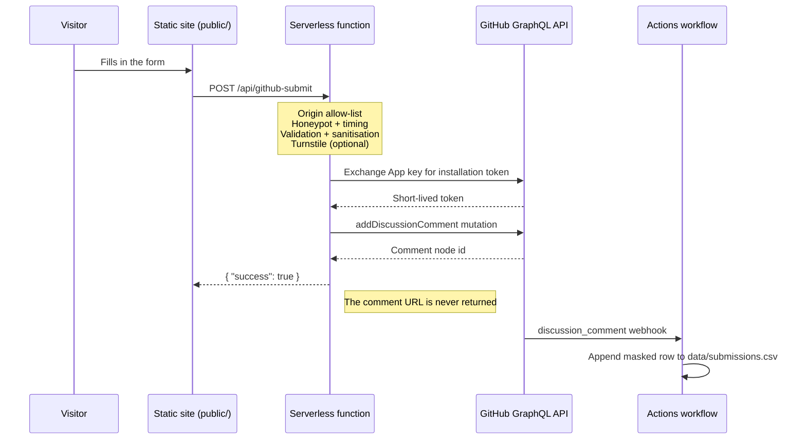

# Architecture

## Why GitHub Discussions?

Contact forms need somewhere to put messages. The usual options are a database
(operational cost), a SaaS form service (per-submission pricing, third-party
data processing) or email relay (deliverability headaches).

GitHub Discussions is already free, already authenticated, already has an audit
trail, already has search, already sends notifications, and already emits
webhooks you can automate against. It just needed a write-only front door.

## Request flow



## Module layout

```
public/                 Static site — no build step
  config.js             The only file most adopters edit. Contains no secrets.
  app.js                Branding, routing, theme, form submission
  index.html            Markup with data-brand-* hooks
  style.css             Design tokens + components
  _headers              Security headers (Cloudflare Pages)

lib/                    Platform-agnostic backend
  config.js             Env parsing, discussion map resolution, limits
  validate.js           Input validation, sanitisation, comment rendering
  cors.js               Origin allow-listing
  turnstile.js          Optional captcha verification
  handler.js            Core pipeline + per-platform adapters

api/github-submit.js         Vercel (default export) + Netlify (handler export)
functions/api/github-submit.js  Cloudflare Pages (onRequestPost/onRequestOptions)
```

The two entry points are three lines each. **All logic lives in `lib/`**, which
is what stops the platforms from drifting apart — the original version of this
project had two independently maintained copies that had already diverged.

## Trust boundaries

Everything crossing into the system from the browser is untrusted:

1. **Transport** — `lib/cors.js` decides whether the origin may talk to us at all.
2. **Shape** — `lib/validate.js` enforces types, lengths and formats, and strips
   control characters.
3. **Rendering** — `buildComment()` neutralises `@mentions` and `#123`
   references, then wraps the message in a code fence sized to be longer than
   any backtick run inside it, so user text cannot forge the `**Name:**` header
   fields that the export workflow parses.
4. **Downstream** — the export workflow reads the comment body inside
   `actions/github-script` (JavaScript), never through `${{ }}` shell
   interpolation, and CSV-quotes plus formula-guards every value.

Errors flow the other way through a single funnel in `lib/handler.js`: only
`ValidationError` messages reach the user. Everything else is logged and
replaced with a generic message so GitHub API internals and configuration state
never leak.

## Design constraints

These are deliberate and PRs that break them will be asked to change:

- **No build step.** Plain ES modules everywhere. Clone, set env vars, deploy.
- **No frontend framework.** ~250 lines of vanilla JS is enough.
- **One runtime dependency.** `@octokit/auth-app`, only because RSA-signed JWT
  minting is not something to hand-roll.
- **No read path.** There is deliberately no code that queries or lists
  discussions. The endpoint can only append.
